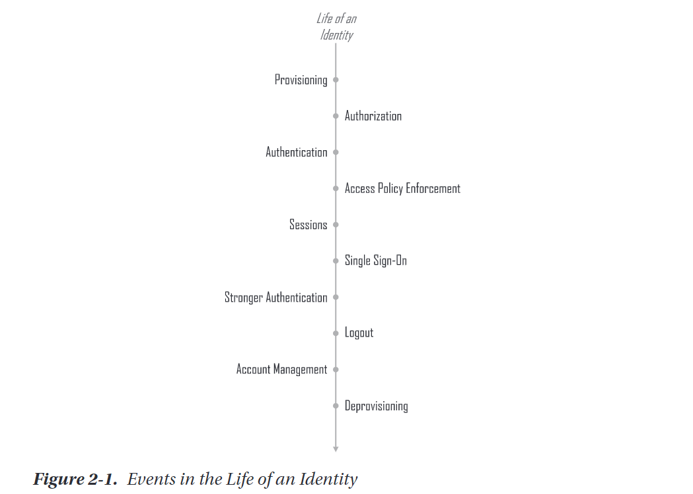

# The life of an Identity

## Terminology

`Identity` is a collection of attributes with a specific person or entity in a particular context. Identity attributes may be contained within an application's account object, or they may be stored separately and referenced from the account object.

Identity management system is a set of services that support creation, modification, & removal of identities and associated accounts, as well as the authentication & authorization required to access resurces.

## Events in the life of identity

### Provisioning

The act of creating an account and associated identity information is often referred to as provisioning.

### Authorization

When account is created, it is often necessary to specify what the account can do, in the form of privileges.

### Authentication

The credentials may involve something the user knows, something the user has, and/or something the user is. A password is something the user *knows*. A numeric code generated from a previously registered device, such as a mobile phone, involves something the user *has*. Biometric information such as a fingerprint is something the user *is*.

### Access policy enforcement

In other words, authorization specifies what a user or entity is allowed to do, and access policy enforcement checks that a user’s requested actions are allowed by the privileges they’ve been authorized to use.

### Sessions

A session tracks information such as whether the user has been authenticated, and if so, typically also the authentication mechanism or strength level used, and when authentication occurred, in addition to a user identifier. 

### Single Sign-On (SSO)

Single sign-on (SSO) is the ability to log in once and then access additional protected resources or applications with the same authentication requirements, without having to reenter credentials.

Single sign-on is possible when a set of applications has delegated authentication to the same entity. An authenticated session in that entity that can be used to access multiple resources via single sign-on is often called an SSO session.

### Stronger Authentication

Step-up authentication and multi-factor authentication (MFA) both involve authenticating a user with stronger forms of authentication. 

### Logout

At a minimum, the act of logging out should terminate the user’s application session. *If they return to the application, they would have to authenticate again before being granted access.* In situations where single sign-on is used, there may be multiple sessions to terminate, and it is a design decision as to which sessions should be terminated when the user logs out of one application.

### Account managemnt & recovery

Account recovery is a mechanism to validate a user is the legitimate owner of an account through some secondary means and then allow the user to establish new credentials.

### Deprovisioning

It means user account & associated identity can no longer be used. Deprovisioning may take the form of completely deleting the account and associated identity information or simply disabling the account, to preserve information for audit purposes.