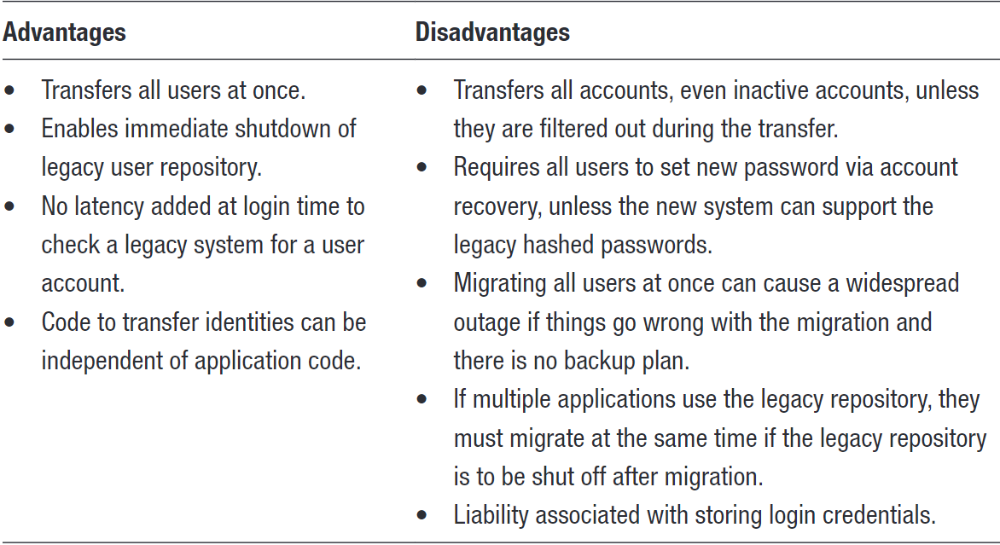

# Identity Provisioning

## Provisioning Options

### Self-registration

### Invite only registration

### Identity Migration

Storing passwords in hashed format allows validation of entered passwords but prevents administrators with access to password repositories from seeing cleartext passwords and makes it difficult to use the passwords if the storage repository is compromised or stolen.

#### Support Legacy Hashing Algorithm

#### Bulk Identity Migration

#### Gradual Migration of Users

### Administrative account creation

Below points should take into account
- The size of an organization
- Frequency with which new users need to be added
- Whether provisioning needs to be done across domains

### Leverage Existing Identity Service

## Selecting an external identity service

## Identity Provider Selection

## Choosing & Validating Identity Attributes
