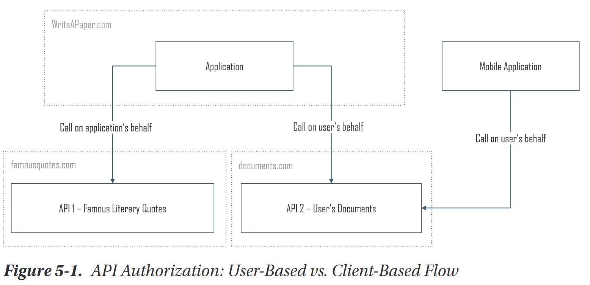
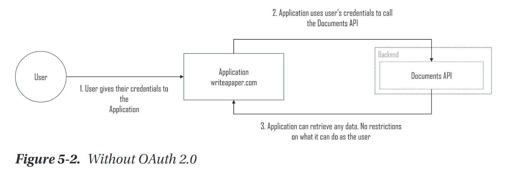
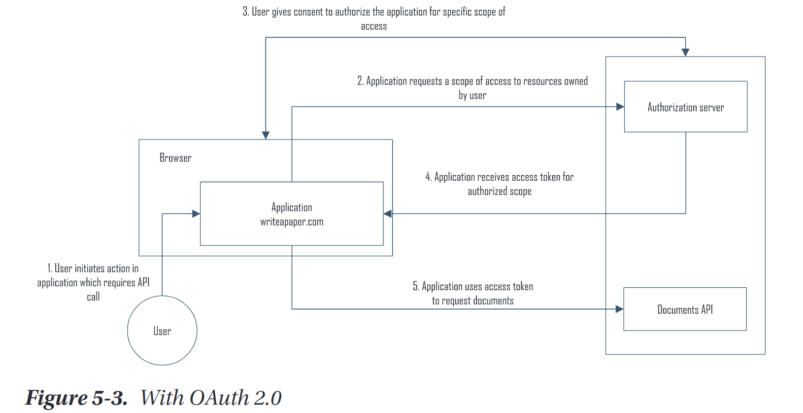
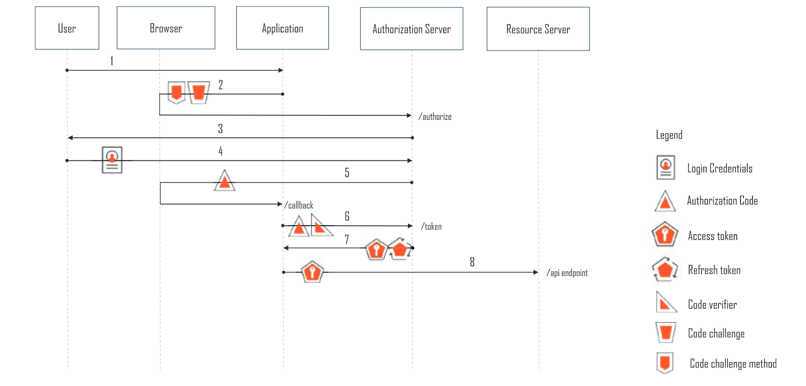

# OAuth 2.0 & API Authorization

If an application wants to call an API on a user’s behalf to access resources owned by the user, it needs the user’s consent.

## API Authorization

An application may need to call an API on behalf of a user, to access content owned by the user, or on its own behalf if the application owns the desired content.



## Oauth 2.0

>**With OAuth 2.0, an application can obtain a user’s consent, to call an API on their behalf, and not need their credentials for the API site.**

Resource owner (user) allow resources on one site (resource server) owned by him/her to other site (application).

### Without Oauth 2.0

Before Oauth 2.0, user (resource owner) shares credentials with application for accessessing resources from resource server.

>example, I want to store my app.digrams.net diagrams to google drive. then I should give app.diagrams.net my google drive credentials.

#### Disadvantage

If app.digrams.net were compromised, and the password decryption key or cleartext passwords stolen, the user’s data at google drive would be at risk. The user also had no way of revoking app.diagrams.net's access to google drive except by changing their credentials which would revoke access for any other applications that needed access to documents.



### With Oauth 2.0

when an application needs to call an API on behalf of a user, it sends an authorization request to an authorization server for the API. An authorization server handles access requests for an API and returns a security token that can be used by the application to access the API. In the authorization request, the application gives an indication (known as the “scope”) of what it wants to request from the API. The authorization server evaluates the request and, if authorized, returns a token to the application



>OAuth 2.0 protocol provides an authorization solution, not an authentication solution.

## Terminology

### Roles

- **Resource Server**: Service storing protected resources to be accessed by an application
- **Resource Owner**: User or other entity that owns protected resources at the resource server
- **Client**: Application which needs to access resources on resource owner's behalf or on its own behalf.
- **Authorization server**: service trusted by the resource server to authorize applications to call the resource server.

### Confidential vs Public Clients

- **Confidential Client**: An application that runs on a protected server and can securely store confidential secrets to authenticate itself to an authorization server.
- **Public Client**: An application that executes primarily on the user’s client device (native application) or in the client browser and cannot securely store a secret.

### Client Profiles

- **Web application**: A confidential client with code executing on a protected, back-end server. The server can securely store any secrets needed.
- **User Agent-based app**: Assumed to be a public client with code executing in the user’s browser.
- **Native application**: Assumed to be a public client that is installed and executed on the user’s device, such as a mobile application or desktop application.

### Token and Authorization code

- **Authorization code**: An intermediary, opaque code returned to an application and used to obtain an access token and optionally a refresh token. Each authorization code is used once.
- **Access token**:  A token used by an application to access an API. 
- **Refresh token**: An optional token that can be used by an application to request a new access token when a prior access token has expired


## How it works

The OAuth 2.0 Authorization Framework specification defines four methods. Each method uses a different type of credential to represent the authorization. These credentials are known as authorization grants. **The type of authorization grant to use depends on the use case and type of application.**

### Authorization code grant

uses 2 request
1. user’s browser is redirected to the authorization endpoint at the authorization server with a request to authorize an API call to be made on the user’s behalf. After obtaining the user’s consent, the authorization server redirects the user’s browser back to the application with an **authorization code**.

2. The application uses the authorization code to send a second, **backchannel request** to the authorization server’s token endpoint to obtain an **access token**.



>An added side benefit is that the tokens are returned via secure backchannel response.

#### PKCE (roof Key for Code Exchange)

On 6th step in above digram, code verifier is PKCE.

PKCE is a mechanism that can be used with authorization and token requests to ensure that the **application that requested an authorization code is the same application that uses the authorization code to obtain an access token**. PKCE protects against a malicious process, especially on mobile devices and with public clients, that could intercept an authorization code and use it to get an access token

#### Authorization Request (Step 2)

```
GET /authorize?

response_type =code
& client_id   =<id for app, assigned when 
                it registered with auth server>
& state       =<non-guessable string, unique for each call, 
                opaque to auth server and used to track 
                state between corresponding request &
                response to mitigate risk of CSRF.>
& scope       =<scope of access privileges for which 
                authorization is requested 
                example, "get:documents">
& redirect_uri=<auth server sends code to this callback uri>
& resource    =<Identifier for a specific apI registered 
                at authorization server for which the 
                access token is requested. 
                Some implementations may use other names, 
                such as “audience.” 
                this parameter isn’t needed unless 
                there are multiple possible APIs.>
& code_challenge=<PKCE code_challenge>
& code_challenge_method=<"S256" or "plain"> HTTP/1.1 
Host: authorizationserver.com
```

#### Response (Step 5)

```
HTTP/1.1 302 Found
Location: https://clientapplication.com/callback?

code   =<used by the application to request an access token>
& state=<application must validate that the state value in 
         the response matches the state value sent with the initial 
         request.>
```

#### Calling token endpoint (Step 6)

```
POST /token HTTP/1.1
Host: authorizationserver.com
Content-Type: application/x-www-form-urlencoded

grant_type     =authorization_code
& code         =<authorization_code>
& client_id    =<client id>
& code_verifier=<code verifier>
& redirect_uri =<Should match the redirect_uri value 
                 passed in the authorization request
                 to the authorize endpoint.>
```

#### Response from token endpoint (Step 7)

```
HTTP/1.1 200 OK
Content-Type: application/json;charset=UTF-8
Cache-Control: no-store
Pragma: no-cache
{
    "access_token":"<access_token_for_API>",
    "token_type":"Bearer",
    "expires_in":<token expiration>,
    "refresh_token":"<refresh_token>"
}
```


### Implicit grant

>This grant type which was optimized for use with **public clients** such as single-page applications.


### Resource owner password credentials grant

### Client credentials grant