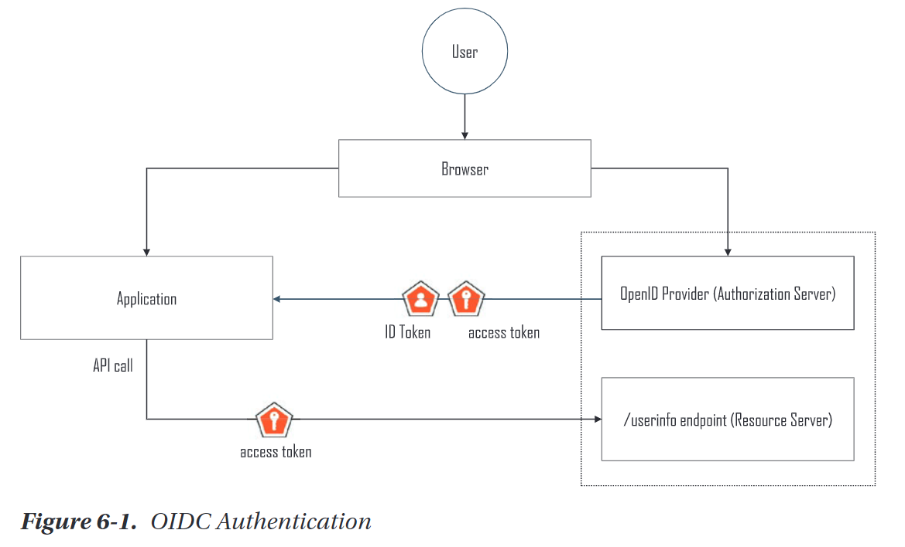
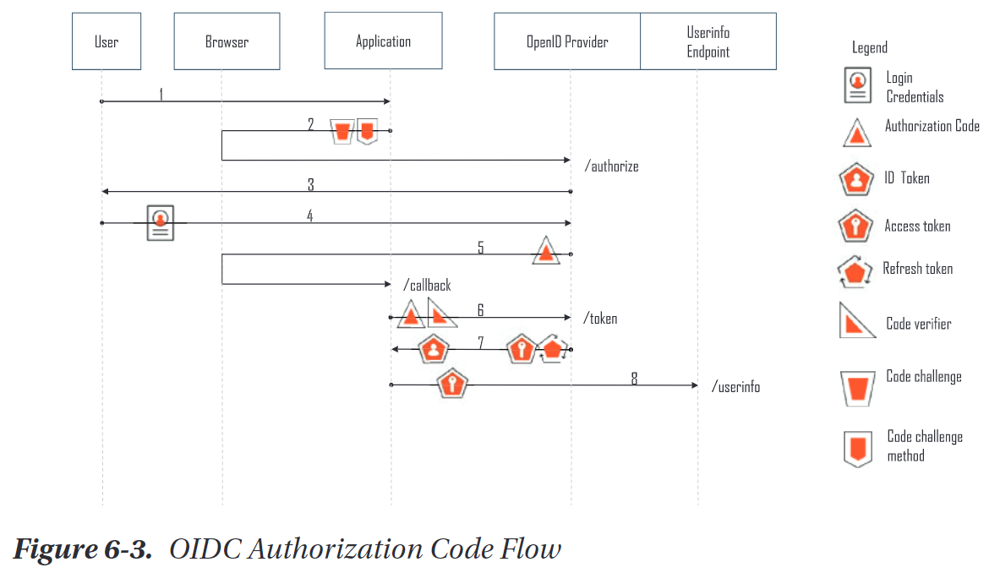

# OpenID Connect

OIDC protocol provides an identity service layer on top of OAuth2.0, designed to **allow authorization servers to authenticate users** for application and return in a standard way.

### Problem to solve

OIDC enables an application to **delegate user authentication to OAuth2.0 authorization server** & have it **return to the application claims** about authenticated user and authentication event in a standard format.

## Terminology

### Roles

- **End User**: Subject to be authenticated
- **OpenID Provider (OP)**: OAuth 2.0 authorization server that implements OIDC
- **Relying Party (RP)**: Application which want to get claim info for user.

### Client Types

Best for applications installed on and run natively on, a user's device.

### Tokens & Authorization Code

OIDC uses OAuth 2.0 info (Authorization code, access token, refresh token) + **ID Token**

**ID Token**: A token used to convey claims about an authentication event and an authenticated user to a relying party (application)

### Endpoints

OAuth 2.0 endpoints + **Userinfo endpoint** (Returns claims about an authenticated user. calling the endpoint requires and access token, and the claims returned are governed by the access token)

### ID Token

ID Tokens are JWT which contains **authentication event & authenticated user**

## OIDC Flows

### OIDC Authorization Code Flow

- Similar to OAuth 2.0 authorization code grant flow
- Rely on two requests and an intermediary authorization code.

1. User accesses application
2. Browser redirects to OpenID provider
3. OP interacts with user for authentication & obtain consent for **scope of user info**
4. browser redirects back to application with **authorization code**
5. application (RP) sends token request with authorization code
6. OP responds with ID token, access token and optionally refresh token.
7. application can use access token for UserInfo endpoint.

>Second call to token endpoint to obtain security tokens assumes the application has the ability to authenticate itself to OP.

### Implicit Flow

### Hybrid Flow